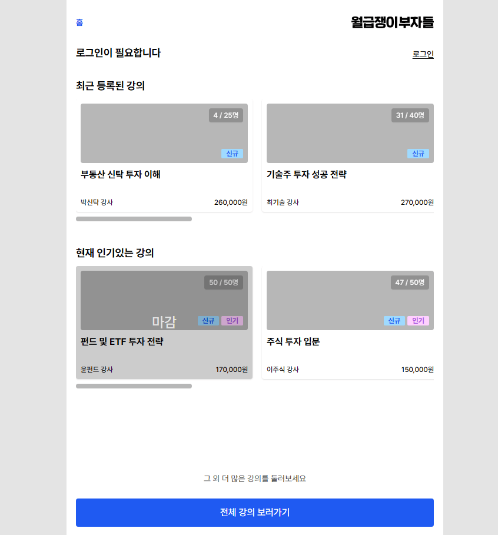
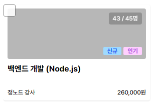
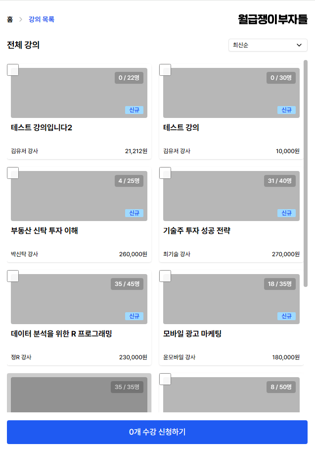
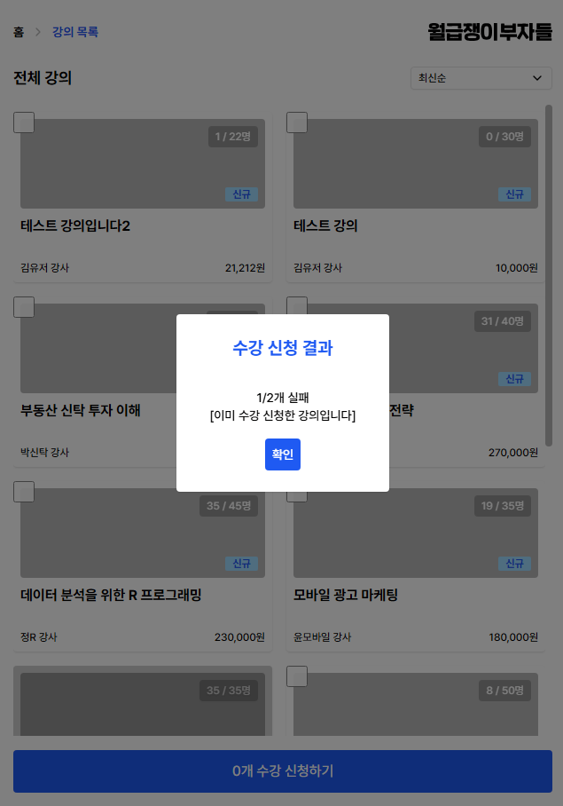
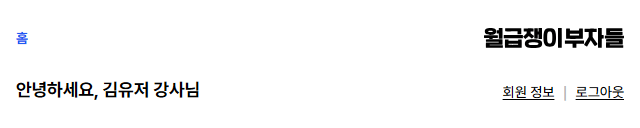
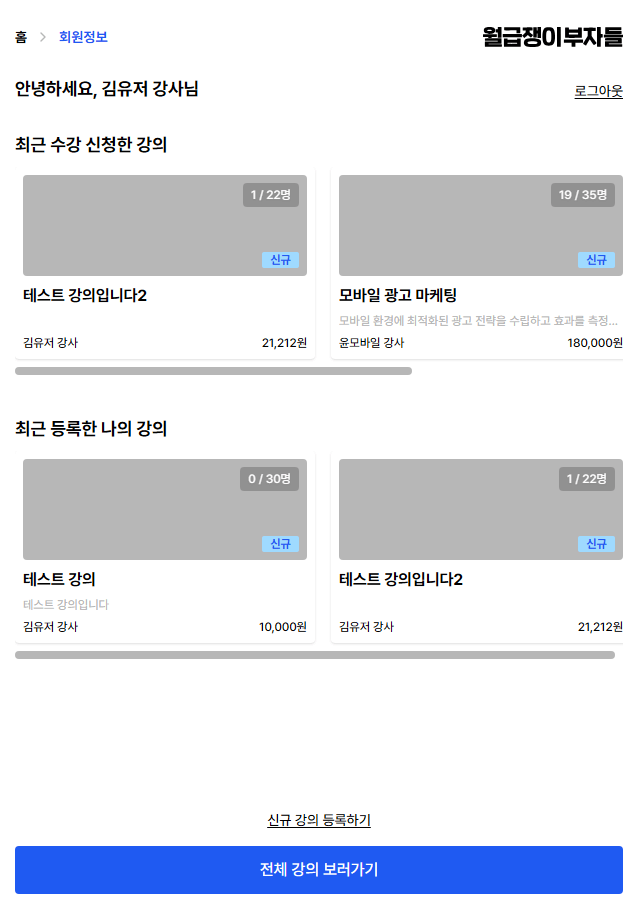
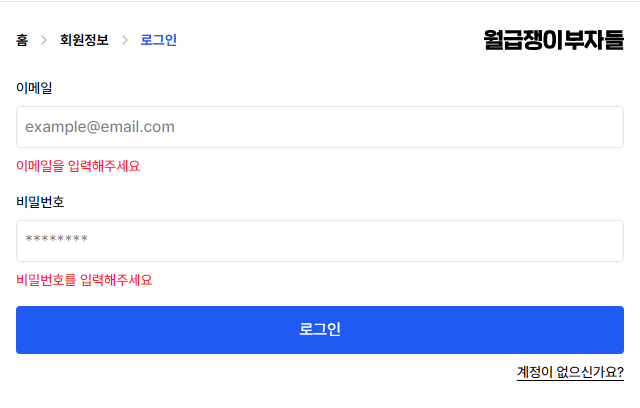
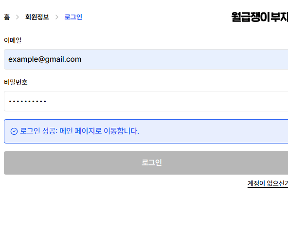

## 월부 대시보드



월부 강의를 위한 회원 / 강사 통합 대시보드입니다.
회원은 강의를 탐색하고 수강 신청할 수 있으며, 강사는 강의를 등록하고 수강 신청할 수 있습니다.

### 소개

이 프로젝트는 Next.js App Router 기반 SSR 중심 설계를 목표로 구현되었습니다. 가능한 영역은 서버 컴포넌트로 작성하여 초기 렌더링 성능을 확보하고, 상태 변화가 잦거나 데이터 일관성 문제가 발생하는 영역은 클라이언트 컴포넌트로 분리했습니다.

서버에서 제공되는 데이터가 항상 이상적이지 않다는 전제하에,
프론트엔드에서 이를 어떻게 보완하고 안정적인 UX를 제공할 수 있을지를 중점적으로 고민한 프로젝트입니다.

주요 기능으로는

- 무한 스크롤 (TanStack Query + SSR Prefetch + Hydration)
- middleware로 미인증시 리다이렉트
- 서버사이드 렌더링
- 데이터 캐싱
  이 있습니다.

사용 스택: Typescript, Next.js, TanStack Query, React Hook Form, Tailwind CSS, clsx, twMerge, lucide-react

### 실행

```
pnpm install
pnpm dev

```

백엔드는 로컬에서 Docker 이미지로 실행 중이라고 가정합니다.
모든 API는 http://localhost:8080을 참조합니다.

### 주요 플로우

- 홈 화면 진입
- 로그인 / 회원가입
- 홈 화면 리다이렉트
- 회원 정보 확인
- 강의 목록 진입
- 강의 선택 및 수강 신청

### 핵심 포인트

```
GET /api/courses?page=0&size=10&sort=recent
```

강의 목록 API는 페이지네이션과 정렬을 지원합니다. 하지만 실제 서버 응답을 확인해보면 1차 정렬만 적용되어 있는 것으로 보였습니다. 동일한 정렬 값 (예: popular 기준일 때 동일한 maxStudents 값을 가진 요소)이 존재하는 경우 2차 정렬 기준 (id 또는 createdAt 등)이 없어서 페이지 단위로 나눠 호출시 중복 강의가 반환되는 것으로 보입니다.

초기에는 강의 목록과 수강 신청 폼을 모두 서버 컴포넌트 + server action으로 구현했지만, 폼 제출 후 리렌더링 시 앞선 정렬 이슈로 인해 강의 목록 순서가 바뀌는 문제가 발생했습니다. 이로 인해 강의 목록을 완전히 SSR로 유지하는 것이 어려웠습니다.

서버를 수정할 수 없는 상황이므로, 프론트에서 임시로 id 기준 중복 제거를 적용했습니다.

```
useEffect(() => {
    if (!data?.pages) return;

    /**
     * 서버에서 2차 정렬이 없어서 중복 강의가 올 수 있다.
     * 프론트 단에서 임시로 set을 사용해 중복을 제거
     */
    setVisibleCourses((prev) => {
      const seen = new Set(prev.map((c) => c.id));
      const next = [...prev];

      for (const page of data.pages) {
        for (const c of page.content ?? []) {
          if (seen.has(c.id)) continue;
          seen.add(c.id);
          next.push(c); //기존 순서대로 추가
        }
      }

      return next;
    });
  }, [data]);
```

이 문제로 인해 강의 목록의 수강 신청 폼 처리 방식도 변경했습니다.
server action 기반 폼 제출 대신, 클라이언트에서 직접 처리하도록 수정했습니다.

```
<form
        onSubmit={handleSubmit}
        className="flex flex-col h-full overflow-hidden relative"
      >
        <section
          ref={listRef}
          className="flex flex-col md:grid md:grid-cols-2 gap-4 py-2 overflow-y-auto h-full"
        >
          {visibleCourses.map((course) => (
            <CourseCard
              key={course.id}
              course={course}
              isChecked={selectedCourseIds.has(course.id)}
              onCheckboxChange={(isChecked) =>
                handleCheckboxChange(course.id, isChecked)
              }
            />
          ))}

          <InfiniteScrollObserver
            rootRef={listRef}
            enabled={!pending && !isOpen}
            hasMore={!pending && !isOpen && (hasNextPage ?? false)}
            isLoading={isFetchingNextPage}
            onLoadMore={fetchNextPage}
          />
        </section>
 ...

```

대신 강의 목록 페이지 자체는 서버 컴포넌트로 유지하고,
첫 페이지 데이터만 서버에서 미리 fetch하여 캐싱했습니다.

```
export default async function CoursePage({ searchParams }: CoursePageProps) {
 const params = await searchParams;
 const sortBy = params.sort || "recent";

 // 첫 페이지만 prefetch
 const queryClient = getQueryClient();
 const firstPage = await fetchCoursesServer(sortBy, COURSES_PAGE_SIZE, 0);

 queryClient.setQueryData(courseKeys.infinite(sortBy, COURSES_PAGE_SIZE), {
   pages: [firstPage],
   pageParams: [0],
 });

 ...
```

이 구조를 통해 초기 로딩 성능과 UX를 동시에 확보할 수 있었습니다.

### 홈 화면


홈 화면은 기본적으로 SSR로 유지하여, 렌더링 이전에 필요한 모든 데이터를 서버에서 가져옵니다.

```
export default async function Home() {
  //모든 데이터를 받을 때까지 대기 후 렌더링
  const [recentData, popularData, userProfile] = await Promise.all([
    fetchCoursesServer("recent", 6),
    fetchCoursesServer("popular", 6),
    fetchUserProfileFromServer().catch(() => null),
  ]);

  ...

```

서버에서 데이터를 fetch한 뒤,
최신 강의와 인기 강의를 간단하게 노출합니다.

### 강의 카드



강의 카드(Course Card)는 실제 이미지 데이터는 없지만,
실제 서비스와 유사한 UI를 위해 이미지 영역을 포함하도록 구성했습니다.

```
<input
            type="checkbox"
            name="courseId"
            value={course.id}
            checked={isChecked}
            onChange={(e) => onCheckboxChange?.(e.target.checked)}
            className="absolute z-20 -left-2 -top-2 w-6 h-6 opacity-90 rounded-sm accent-theme outline:ring-2 outline-theme cursor-pointer"
            aria-label={`${course.title} 강의 선택`}
          />

...

```

기본적으로 체크박스를 포함하고 있으며,
onCheckboxChange를 통해 상위 컴포넌트에 선택 상태를 전달합니다.

```
/**
 * 강의 카드 컴포넌트
 * @description
 * - 강의 정보 표시 (제목, 설명, 강사명, 가격, 수강생 현황)
 * - 태그 표시 (신규, 마감, 인기)
 * - 체크박스: 수강 신청용 (readonly 모드에서 숨김)
 */
export function CourseCard({
  course,
  isChecked = false,
  readonly = false,
  onCheckboxChange,
}: CourseCardProps) {
  const tags = [];

  // createdAt이 현재로부터 기준 일 (RECENT_DAYS_THRESHOLD) 이내면 "신규" 태그 추가
  const createdAt = new Date(course.createdAt);
  const now = new Date();
  const diffInDays =
    (now.getTime() - createdAt.getTime()) / (1000 * 60 * 60 * 24);
  if (diffInDays <= RECENT_DAYS_THRESHOLD) {
    tags.push(TAGS.find((tag) => tag.label === "신규")!);
  }

  // 마감 임박 태그 (현재 수강생이 최대 수강생의 90% 이상일때 ) (100퍼도 추가)
  if (course.currentStudents / course.maxStudents >= 0.9) {
    tags.push(TAGS.find((tag) => tag.label === "인기")!);
  }

...

```

서버에서 내려온 데이터를 기반으로
신규 / 인기 / 마감 임박 태그를 자동으로 계산해 부여합니다.
마감된 강의는 별도 안내와 함께 선택이 불가능하도록 처리했습니다.

### 강의 목록



강의 목록의 서버 데이터 캐싱과 상태 관리를 위해 TanStack Query를 사용했습니다.
useInfiniteQuery를 통해 페이지 단위 데이터를 관리하고,
이미 로드된 페이지는 캐시에 유지합니다.

```
export const courseQueries = {
  //무한 스크롤 강의 목록 쿼리
  infinite: (sort: SortOption, size = 10) =>
    infiniteQueryOptions({
      queryKey: courseKeys.infinite(sort, size),
      queryFn: ({ pageParam }) => fetchCourses(pageParam, sort, size),
      initialPageParam: 0,
      getNextPageParam: (lastPage) =>
        lastPage.last ? undefined : lastPage.pageable.pageNumber + 1,
    }),

...

```

무한 스크롤은 Intersection Observer를 사용해 구현했습니다.
과도한 연속 호출을 방지하기 위해 throttle을 적용했습니다.

```
useEffect(() => {
    if (!enabled) return;
    if (!hasMore) return;

    const observer = new IntersectionObserver(
      ([entry]) => {
        if (!entry.isIntersecting) return;
        if (loadingRef.current || isLoading) return;

        // 로딩 중이면 스킵
        if (loadingRef.current || isLoading) return;

        //throttle로 과도한 호출 방지
        const now = Date.now();
        if (now - lastFireRef.current < throttleMs) return;
        lastFireRef.current = now;

        loadingRef.current = true;
        Promise.resolve(onLoadMore()).finally(() => {
          loadingRef.current = false;
        });
      },
      {
        root: rootRef?.current ?? null, //scroll container 기준
        rootMargin: "200px 0px",
        threshold: 0,
      },
    );

    const el = observerRef.current;
    if (el) observer.observe(el);

    return () => {
      if (el) observer.unobserve(el);
      observer.disconnect();
    };
  }, [enabled, hasMore, isLoading, onLoadMore, rootRef, throttleMs]);
```

강의 목록 화면에서는 첫 페이지 데이터를 미리 fetching해오고, 클라이언트 query 캐시에 hydrate해서 초기 로딩을 줄였습니다.

강의 목록 재정렬시 주소를 변경해서 새로운 sort 기준으로 요청을 보냅니다.
드롭다운 선택으로 기준을 변경할 수 있습니다. 목록이 새로 바뀌기 때문에 기존 데이터를 초기화합니다.

```
// sort 변경 시 초기화 & 스크롤 최상단
  useEffect(() => {
    setVisibleCourses([]);
    setSelectedCourseIds(new Set());
    listRef.current?.scrollTo({ top: 0, behavior: "auto" });
  }, [sortBy]);
```

```
export function SortDropdown({ currentSort }: { currentSort: SortOption }) {
  const router = useRouter();

  const handleChange = (value: string) => {
    // 정렬이 바뀐 경우는 페이지 정보 필요 없음
    router.replace(`/course?sort=${value}`, { scroll: true });
  };

  return (
    <Dropdown
      value={currentSort}
      onChange={handleChange}
      options={SORT_OPTIONS}
    />
  );
}
```

### 수강 신청

강의 목록 페이지는 목록 겸 수강 신청 기능으로 사용됩니다.
수강신청을 취소하는 api나 유저가 현재 신청한 강의를 반환하는 api는 현재 제공되지 않았기 때문에 신청 상태는 별도로 표기 하지 않았습니다.

```
try {
    const response = await fetch(`${BASE_URL}/api/enrollments/batch`, {
      method: "POST",
      headers: {
        "Content-Type": "application/json",
        Authorization: `Bearer ${accessToken}`,
      },
      body: JSON.stringify({ courseIds: parsedIds }),
    });

...


// 성공과 실패 결과가 섞여있음 (부분 성공도 요청 성공으로)
    return {
      success: true,
      message: "수강 신청이 완료되었습니다.",
      data: result,
    };

```

배치 수강 신청 API는 성공과 실패가 혼합된 결과를 반환하므로,
응답 데이터를 기반으로 모달에 상세 결과를 노출합니다.

```
/**
 * 강의 배치 수강 신청 상태를 받아서 부분 실패 여부를 판단
 * 성공한 강의는 넘어간다
 *
 * @returns string 실패한 강의 이유를 중복 없이 나열한 문자열
 */
import type { EnrollmentRequestStatus } from "@/types";

export function parseEnrollmentStatus(status: EnrollmentRequestStatus): string {
  if (!status.data) {
    return "수강 신청 결과를 불러올 수 없습니다.";
  }

  if (status.data.failed.length === 0) {
    return `${status.data.success.length}/${status.data.success.length}개 성공\n[선택된 강의를 수강 신청했습니다]`;
  }

  // 실패한 이유들을 중복 없이 수집
  const reasons = new Set<string>(
    status.data.failed.map((course) => course.reason),
  );

  let result = `${status.data.failed.length}/${status.data.success.length + status.data.failed.length}개 실패`;

  reasons.forEach((reason) => {
    result += `\n[${reason}]\n`;
  });
  return result;
}
```

신청 실패한 강의는 실패 사유를 set을 이용해서 중복 없이 저장하고 공용 ui 컴포넌트인 modal에 노출해서 유저에게 안내합니다.



### 인증과 리다이렉트



```
**
 * 로그인 API
 * POST /api/users/login
 * body: { email, password }
 * 서버에서 받은 accessToken을 HttpOnly 쿠키로 설정
 */
export async function POST(request: NextRequest) {
  try {
    const body = await request.json();
    const res = await apiRequest<LoginApiResponse>(
      `${BASE_URL}/api/users/login`,
      {
        method: "POST",
        data: body,
      },
    );

    const cookieStore = await cookies();
    cookieStore.set("accessToken", res.accessToken, COOKIE_SETTINGS);

    // 필요한 유저 정보만 쿠키에 저장 (이름, 역할)
    cookieStore.set(
      "user",
      encodeURIComponent(
        JSON.stringify({
          name: res.user.name,
          role: res.user.role as Role,
        } as UserProfile),
      ),
      COOKIE_SETTINGS,
    );

...

```

로그인 시 서버에서 받은 accessToken과 사용자 정보(이름, 역할)를
HttpOnly 쿠키로 저장합니다.

```
/**
 * 로그아웃 API
 * POST /api/users/logout
 * accessToken + 유저 정보 쿠키 제거
 */
export async function POST() {
  const cookieStore = await cookies();

  cookieStore.delete("accessToken");
  cookieStore.delete("user");
  cookieStore.delete("recentlyAddedCourseIds");
  cookieStore.delete("enrolledCourseIds");

  return NextResponse.json({ message: "Logged out" }, { status: 200 });
}

```

로그아웃시 쿠키를 정리합니다.

```
const accessToken = request.cookies.get("accessToken")?.value;

  if (!accessToken) {
    const loginUrl = request.nextUrl.clone();
    loginUrl.pathname = "/auth/login";
    loginUrl.searchParams.set("redirect", pathname);
    loginUrl.searchParams.set("reason", "auth"); // 리다이렉트된 이유를 클라이언트에 전달
    return NextResponse.redirect(loginUrl);
  }

```

쿠키를 베이스로 유저의 로그인 상태를 확인합니다. 미로그인시 로그인 화면으로 리다이렉트 하고 params에 이유를 함께 포함해서 리다이렉션 이후에 모달로 안내 메세지를 노출합니다.

### 쿠키 활용

서버 컴포넌트가 대부분이기 때문에 간단한 정보 저장을 위해서 쿠키를 활용했습니다. 서버 사이드에서 접근이 불가하고 토큰과 쿠키 상태의 동기화를 위해 localstorage는 사용하지 않았습니다.

```

//신규 추가된 강의의 id를 쿠키에 저장해서 최근 등록 강의 섹션에서 사용 (최대 6개)
    const cookiesStore = await cookies();
    const existingCourseIds = cookiesStore.get("recentlyAddedCourseIds")?.value;
    let courseIds: number[] = [];
    if (existingCourseIds) {
      courseIds = JSON.parse(decodeURIComponent(existingCourseIds));
    }
    courseIds.push(res.id);
    if (courseIds.length > 6) {
      courseIds = courseIds.slice(-6);
    }
    cookiesStore.set(
      "recentlyAddedCourseIds",
      encodeURIComponent(JSON.stringify(courseIds)),
      COOKIE_SETTINGS,
    );

```

강사가 강의를 등록한 후에는 신규 추가한 id를 쿠키에 갱신해서 서버 컴포넌트인 회원정보 페이지를 불러올 때 id에 접근해서 강의 정보를 호출하고 완성된 데이터로 페이지를 로드할 수 있게 했습니다.



```
/**
 * 강사인 경우 - 쿠키를 기반으로 최근 추가한 강의들을 보여주는 인증 페이지
 * 기본 - 최근 수강신청한 강의 목록 (최대 6개)
 */
export default async function AuthPage() {
  const cookieStore = await cookies();
  const rawCourseIds = cookieStore.get("recentlyAddedCourseIds")?.value;
  const rawEnrolledIds = cookieStore.get("enrolledCourseIds")?.value;
  let recentCourseIds: number[] = [];
  let enrolledCourseIds: number[] = [];

  const [userProfile] = await Promise.all([
    fetchUserProfileFromServer().catch(() => null),
  ]);

  if (rawCourseIds && userProfile?.role === "INSTRUCTOR") {
    try {
      recentCourseIds = JSON.parse(decodeURIComponent(rawCourseIds));
    } catch {
      recentCourseIds = [];
    }
  }

  if (rawEnrolledIds) {
    try {
      enrolledCourseIds = JSON.parse(decodeURIComponent(rawEnrolledIds));
    } catch {
      enrolledCourseIds = [];
    }
  }

  const fetchCoursesByIds = async (ids: number[]) => {
    return Promise.allSettled(ids.map((id) => fetchCourseByIdServer(id))).then(
      (results) =>
        results
          .filter(
            (r): r is PromiseFulfilledResult<CourseResponse> =>
              r.status === "fulfilled",
          )
          .map((r) => r.value),
    );
  };

  const [recentCourses, enrolledCourses] = await Promise.all([
    fetchCoursesByIds(recentCourseIds),
    fetchCoursesByIds(enrolledCourseIds),
  ]);

...

```

마찬가지로 유저가 수강신청을 한 후에도 쿠키에 최근에 수강 신청한 강의 id를 저장해서 회원 정보 페이지에 노출합니다.

### 폼 관리



주요 폼은 react hook form을 사용해서 클라이언트에서 입력을 검증합니다.

```
<FormInput
        label="이메일"
        id="email"
        type="email"
        placeholder="example@email.com"
        error={errors.email?.message}
        {...register("email", {
          required: "이메일을 입력해주세요",
          pattern: {
            value: /^[A-Z0-9._%+-]+@[A-Z0-9.-]+\.[A-Z]{2,}$/i,
            message: "올바른 이메일 형식이 아닙니다",
          },
        })}
      />
      <FormInput
        label="전화번호"
        id="phone"
        type="tel"
        placeholder="010-1234-5678"
        error={errors.phone?.message}
        {...register("phone", {
          required: "전화번호를 입력해주세요",
          onChange: (e) => {
            e.target.value = formatKoreanPhone(e.target.value); // 숫자 입력시 자동으로 하이픈 추가
          },
          pattern: {
            value: /^01[0-9]-?[0-9]{3,4}-?[0-9]{4}$/,
            message: "올바른 전화번호 형식이 아닙니다",
          },
        })}
      />

...

```

서버에서 기대하는 형식에 맞게 전화번호에 하이픈을 자동으로 추가하거나, 입력 형태를 검증하는 방식으로 안정성을 더했습니다.

### 공용 ui 컴포넌트

버튼, 모달 등 공용 UI는 조건 기반 클래스 조합으로 재사용성을 높였습니다.

```
export function Button({
  size = "large",
  variant = "primary",
  label,
  type = "button",
  disabled = false,
  onClick,
}: ButtonProps) {
  return (
    <button
      type={type}
      disabled={disabled}
      onClick={onClick}
      className={twMerge(
        clsx(
          "pointer-events-auto flex items-center justify-center text-center py-3 px-4 rounded-sm focus:outline-none focus:ring-0 hover:opacity-80 transition-opacity",
          variant === "primary" && "bg-theme text-white",
          variant === "secondary" && "bg-secondary text-black",
          size === "small" && "w-fit max-w-20 p-2 text-sm",
          size === "medium" && "w-32",
          size === "large" && "w-full",
          disabled && "cursor-default! bg-skeleton hover:opacity-100",
        ),
      )}
    >
      {label}
    </button>
  );
}

```

clsx + twMerge로 Tailwind 충돌 방지하고 전역으로 사용해서 일관된 디자인을 유지합니다.



메세지 컴포넌트 역시 기본 타입과 에러 타입으로 나누어서 전역으로 사용합니다.

```
<aside
      role="alert"
      aria-live="polite"
      className={twMerge(
        clsx("flex flex-row gap-1 items-center p-3 border rounded-sm", {
          "bg-error/10 border-error text-error": status.type === "error",
          "bg-theme/10 border-theme text-theme": status.type === "success",
        }),
      )}
    >
      {status.type === "error" && (
        <TriangleAlert className="w-4 h-4" aria-hidden="true" />
      )}
      {status.type === "success" && (
        <CircleCheck className="w-4 h-4" aria-hidden="true" />
      )}
      <span>{status.message}</span>
    </aside>

```
